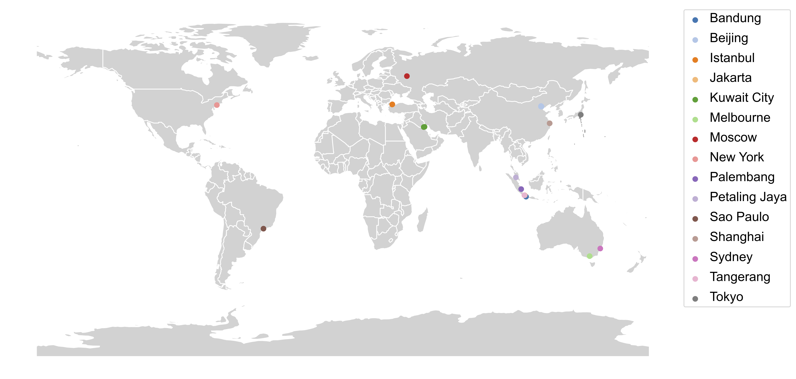

# 🌏 Massive-STEPS: Massive Semantic Trajectories for Understanding POI Check-ins -- Dataset and Benchmarks

<div align="center">

### [Wilson Wongso](https://wilsonwongso.dev)<sup>1,2</sup>, [Hao Xue](https://www.unsw.edu.au/staff/hao-xue)<sup>1,2</sup>, and [Flora Salim](https://fsalim.github.io/)<sup>1,2</sup>

<sup>1</sup> School of Computer Science and Engineering, University of New South Wales, Sydney, Australia<br/>
<sup>2</sup> ARC Centre of Excellence for Automated Decision Making + Society

[](https://huggingface.co/collections/CRUISEResearchGroup/massive-steps-point-of-interest-check-in-dataset-682716f625d74c2569bc7a73)
[](https://arxiv.org/abs/2505.11239)

</div>

## 📖 Introduction



**Massive-STEPS** is a large-scale dataset of semantic trajectories intended for understanding POI check-ins. The dataset is derived from the [Semantic Trails Dataset](https://github.com/D2KLab/semantic-trails) and [Foursquare Open Source Places](https://huggingface.co/datasets/foursquare/fsq-os-places), and includes check-in data from 15 cities across 10 countries. The dataset is designed to facilitate research in various domains, including trajectory prediction, POI recommendation, and urban modeling. Massive-STEPS emphasizes the importance of geographical diversity, scale, semantic richness, and reproducibility in trajectory datasets.

## 🔢 Dataset

### Download Preprocessed Dataset

Massive-STEPS is available on [🤗 Datasets](https://huggingface.co/collections/CRUISEResearchGroup/massive-steps-point-of-interest-check-in-dataset-682716f625d74c2569bc7a73). You can download the preprocessed dataset of each city using the following links:

| City            | Users  | Trails  |  POIs  | Check-ins | #train  |  #val  | #test  |                                          URL                                          |
| --------------- | :----: | :-----: | :----: | :-------: | :-----: | :----: | :----: | :-----------------------------------------------------------------------------------: |
| Bandung 🇮🇩       | 3,377  | 55,333  | 29,026 |  161,284  | 38,732  | 5,534  | 11,067 |    [🤗](https://huggingface.co/datasets/CRUISEResearchGroup/Massive-STEPS-Bandung/)    |
| Beijing 🇨🇳       |   56   |   573   | 1,127  |   1,470   |   400   |   58   |  115   |    [🤗](https://huggingface.co/datasets/CRUISEResearchGroup/Massive-STEPS-Beijing/)    |
| Istanbul 🇹🇷      | 23,700 | 216,411 | 53,812 |  544,471  | 151,487 | 21,641 | 43,283 |   [🤗](https://huggingface.co/datasets/CRUISEResearchGroup/Massive-STEPS-Istanbul/)    |
| Jakarta 🇮🇩       | 8,336  | 137,396 | 76,116 |  412,100  | 96,176  | 13,740 | 27,480 |    [🤗](https://huggingface.co/datasets/CRUISEResearchGroup/Massive-STEPS-Jakarta/)    |
| Kuwait City 🇰🇼   | 9,628  | 91,658  | 17,180 |  232,706  | 64,160  | 9,166  | 18,332 |  [🤗](https://huggingface.co/datasets/CRUISEResearchGroup/Massive-STEPS-Kuwait-City/)  |
| Melbourne 🇦🇺     |  646   |  7,864  | 7,699  |  22,050   |  5,504  |  787   | 1,573  |   [🤗](https://huggingface.co/datasets/CRUISEResearchGroup/Massive-STEPS-Melbourne/)   |
| Moscow 🇷🇺        | 3,993  | 39,485  | 17,822 |  105,620  | 27,639  | 3,949  | 7,897  |    [🤗](https://huggingface.co/datasets/CRUISEResearchGroup/Massive-STEPS-Moscow/)     |
| New York 🇺🇸      | 6,929  | 92,041  | 49,218 |  272,368  | 64,428  | 9,204  | 18,409 |   [🤗](https://huggingface.co/datasets/CRUISEResearchGroup/Massive-STEPS-New-York/)    |
| Palembang 🇮🇩     |  267   |  4,699  | 4,343  |  14,467   |  3,289  |  470   |  940   |   [🤗](https://huggingface.co/datasets/CRUISEResearchGroup/Massive-STEPS-Palembang/)   |
| Petaling Jaya 🇲🇾 | 14,308 | 180,410 | 60,158 |  506,430  | 126,287 | 18,041 | 36,082 | [🤗](https://huggingface.co/datasets/CRUISEResearchGroup/Massive-STEPS-Petaling-Jaya/) |
| São Paulo 🇧🇷     | 5,822  | 89,689  | 38,377 |  256,824  | 62,782  | 8,969  | 17,938 |   [🤗](https://huggingface.co/datasets/CRUISEResearchGroup/Massive-STEPS-Sao-Paulo/)   |
| Shanghai 🇨🇳      |  296   |  3,636  | 4,462  |  10,491   |  2,544  |  364   |  728   |   [🤗](https://huggingface.co/datasets/CRUISEResearchGroup/Massive-STEPS-Shanghai/)    |
| Sydney 🇦🇺        |  740   | 10,148  | 8,986  |  29,900   |  7,103  | 1,015  | 2,030  |    [🤗](https://huggingface.co/datasets/CRUISEResearchGroup/Massive-STEPS-Sydney/)     |
| Tangerang 🇮🇩     | 1,437  | 15,984  | 12,956 |  45,521   | 11,188  | 1,599  | 3,197  |   [🤗](https://huggingface.co/datasets/CRUISEResearchGroup/Massive-STEPS-Tangerang/)   |
| Tokyo 🇯🇵         |  764   |  5,482  | 4,725  |  13,839   |  3,836  |  549   | 1,097  |     [🤗](https://huggingface.co/datasets/CRUISEResearchGroup/Massive-STEPS-Tokyo/)     |

### Dataset Construction

To reproduce the Massive-STEPS dataset, follow these steps:

1. Clone the [Semantic Trails](https://github.com/D2KLab/semantic-trails) repository.
    - This provides the necessary metadata, such as `cities.csv` and `categories.csv` that contains the mapping of POI categories and metadata about each city.
2. Download [Semantic Trails](https://figshare.com/articles/dataset/Semantic_Trails_Datasets/7429076) dataset from Figshare and extract it to `semantic-trails/downloads/`.
   - This provides `std_2013.csv` and `std_2018.csv` that contains the check-in data for 2013 and 2018, respectively. We will be using both subsets to create the Massive-STEPS dataset.
3. Download the city boundaries in GeoJSON format.
   - First, do a lookup of the target city's relation ID from [OpenStreetMap](https://www.openstreetmap.org/).
     - For example, search for "Beijing" and find the relation ID `912940`.
   - Then, using the related ID, download the geographical boundaries of the target city in GeoJSON file format from [Overpass Turbo](https://overpass-turbo.eu/#).
     - We recommend saving the GeoJSON file in the `data/<city_name>` directory.
4. Preprocess the check-in data using the `src/preprocess_std.py` script.
   - This script will filter the check-in data based on the geographical boundaries of the target city and create a CSV file containing the check-in data.
   - The script also filters out trajectories with less than 2 check-ins and users with less than 3 trajectories.
5. Create the next POI dataset using the `src/create_next_poi_dataset.py` script.
   - This script will create a dataset for the next POI recommendation task based on the filtered check-in data:
     - Each trajectory will be treated as a sequence of POIs and the last POI will be the target next POI.
     - Trajectories will also be converted into textual prompts for convenience.
   - The dataset will be split into training, validation, and test sets based on the user IDs.
   - The dataset will also be uploaded to Hugging Face Datasets with the specified dataset ID.

### End-to-End Examples

<details>
<summary>Bandung 🇮🇩</summary>

#### Download Bandung GeoJSON

```sql
[out:json];
relation(13290062);
out geom;
```

#### Preprocess Bandung Dataset

```sh
python src/preprocess_std.py \
    --std_2013_file semantic-trails/downloads/std_2013.csv \
    --std_2018_file semantic-trails/downloads/std_2018.csv \
    --cities_file semantic-trails/cities.csv \
    --categories_file semantic-trails/categories.csv \
    --city_geo_json_file data/bandung/bandung_13290062_overpass.geojson \
    --output_dir data/bandung \
    --output_file bandung_checkins.csv \
    --min_checkins 2 --min_trails 3
```

#### Create Next POI Dataset

```sh
python src/create_next_poi_dataset.py \
    --checkins_file data/bandung/bandung_checkins.csv \
    --dataset_id CRUISEResearchGroup/Massive-STEPS-Bandung
```
</details>

<details>
<summary>Beijing 🇨🇳</summary>

#### Download Beijing GeoJSON

```sql
[out:json];
relation(912940);
out geom;
```

#### Preprocess Beijing Dataset

```sh
python src/preprocess_std.py \
    --std_2013_file semantic-trails/downloads/std_2013.csv \
    --std_2018_file semantic-trails/downloads/std_2018.csv \
    --cities_file semantic-trails/cities.csv \
    --categories_file semantic-trails/categories.csv \
    --city_geo_json_file data/beijing/beijing_912940_overpass.geojson \
    --output_dir data/beijing \
    --output_file beijing_checkins.csv \
    --min_checkins 2 --min_trails 3
```

#### Create Next POI Dataset

```sh
python src/create_next_poi_dataset.py \
    --checkins_file data/beijing/beijing_checkins.csv \
    --dataset_id CRUISEResearchGroup/Massive-STEPS-Beijing
```
</details>

<details>
<summary>Istanbul 🇹🇷</summary>

#### Download Istanbul GeoJSON

```sql
[out:json];
relation(223474);
out geom;
```

#### Preprocess Istanbul Dataset

```sh
python src/preprocess_std.py \
    --std_2013_file semantic-trails/downloads/std_2013.csv \
    --std_2018_file semantic-trails/downloads/std_2018.csv \
    --cities_file semantic-trails/cities.csv \
    --categories_file semantic-trails/categories.csv \
    --city_geo_json_file data/istanbul/istanbul_223474_overpass.geojson \
    --output_dir data/istanbul \
    --output_file istanbul_checkins.csv \
    --min_checkins 2 --min_trails 3
```

#### Create Next POI Dataset

```sh
python src/create_next_poi_dataset.py \
    --checkins_file data/istanbul/istanbul_checkins.csv \
    --dataset_id CRUISEResearchGroup/Massive-STEPS-Istanbul
```

</details>

<details>
<summary>Jakarta 🇮🇩</summary>

#### Download Jakarta GeoJSON
  
```sql
[out:json];
relation(6362934);
out geom;
```

#### Preprocess Jakarta Dataset

```sh
python src/preprocess_std.py \
    --std_2013_file semantic-trails/downloads/std_2013.csv \
    --std_2018_file semantic-trails/downloads/std_2018.csv \
    --cities_file semantic-trails/cities.csv \
    --categories_file semantic-trails/categories.csv \
    --city_geo_json_file data/jakarta/jakarta_6362934_overpass.geojson \
    --output_dir data/jakarta \
    --output_file jakarta_checkins.csv \
    --min_checkins 2 --min_trails 3
```

#### Create Next POI Dataset

```sh
python src/create_next_poi_dataset.py \
    --checkins_file data/jakarta/jakarta_checkins.csv \
    --dataset_id CRUISEResearchGroup/Massive-STEPS-Jakarta
```

</details>

<details>
<summary>Kuwait City 🇰🇼</summary>

#### Download Kuwait City GeoJSON

```sql
[out:json];
relation(305099);
out geom;
```

#### Preprocess Kuwait City Dataset

```sh
python src/preprocess_std.py \
    --std_2013_file semantic-trails/downloads/std_2013.csv \
    --std_2018_file semantic-trails/downloads/std_2018.csv \
    --cities_file semantic-trails/cities.csv \
    --categories_file semantic-trails/categories.csv \
    --city_geo_json_file data/kuwait_city/kuwait_city_305099_overpass.geojson \
    --output_dir data/kuwait_city \
    --output_file kuwait_city_checkins.csv \
    --min_checkins 2 --min_trails 3
```

#### Create Next POI Dataset

```sh
python src/create_next_poi_dataset.py \
    --checkins_file data/kuwait_city/kuwait_city_checkins.csv \
    --dataset_id CRUISEResearchGroup/Massive-STEPS-Kuwait-City
```

</details>

<details>
<summary>Melbourne 🇦🇺</summary>

#### Download Melbourne GeoJSON

```sql
[out:json];
relation(4246124);
out geom;
```

#### Preprocess Melbourne Dataset

```sh
python src/preprocess_std.py \
    --std_2013_file semantic-trails/downloads/std_2013.csv \
    --std_2018_file semantic-trails/downloads/std_2018.csv \
    --cities_file semantic-trails/cities.csv \
    --categories_file semantic-trails/categories.csv \
    --city_geo_json_file data/melbourne/melbourne_4246124_overpass.geojson \
    --output_dir data/melbourne \
    --output_file melbourne_checkins.csv \
    --min_checkins 2 --min_trails 3
```

#### Create Next POI Dataset

```sh
python src/create_next_poi_dataset.py \
    --checkins_file data/melbourne/melbourne_checkins.csv \
    --dataset_id CRUISEResearchGroup/Massive-STEPS-Melbourne
```

</details>

<details>
<summary>Moscow 🇷🇺</summary>

#### Download Moscow GeoJSON

```sql
[out:json];
relation(2555133);
out geom;
```

#### Preprocess Moscow Dataset

```sh
python src/preprocess_std.py \
    --std_2013_file semantic-trails/downloads/std_2013.csv \
    --std_2018_file semantic-trails/downloads/std_2018.csv \
    --cities_file semantic-trails/cities.csv \
    --categories_file semantic-trails/categories.csv \
    --city_geo_json_file data/moscow/moscow_2555133_overpass.geojson \
    --output_dir data/moscow \
    --output_file moscow_checkins.csv \
    --min_checkins 2 --min_trails 3
```

#### Create Next POI Dataset

```sh
python src/create_next_poi_dataset.py \
    --checkins_file data/moscow/moscow_checkins.csv \
    --dataset_id CRUISEResearchGroup/Massive-STEPS-Moscow
```

</details>

<details>
<summary>New York 🇺🇸</summary>

#### Download New York GeoJSON

```sql
[out:json];
relation(175905);
out geom;
```

#### Preprocess New York Dataset

```sh
python src/preprocess_std.py \
    --std_2013_file semantic-trails/downloads/std_2013.csv \
    --std_2018_file semantic-trails/downloads/std_2018.csv \
    --cities_file semantic-trails/cities.csv \
    --categories_file semantic-trails/categories.csv \
    --city_geo_json_file data/new_york/new_york_175905_overpass.geojson \
    --output_dir data/new_york \
    --output_file new_york_checkins.csv \
    --min_checkins 2 --min_trails 3
```

#### Create Next POI Dataset

```sh
python src/create_next_poi_dataset.py \
    --checkins_file data/new_york/new_york_checkins.csv \
    --dataset_id CRUISEResearchGroup/Massive-STEPS-New-York
```

</details>

<details>
<summary>Petaling Jaya 🇲🇾</summary>

#### Download Petaling Jaya GeoJSON

```sql
[out:json];
relation(8347386);
out geom;
```

#### Preprocess Petaling Jaya Dataset

```sh
python src/preprocess_std.py \
    --std_2013_file semantic-trails/downloads/std_2013.csv \
    --std_2018_file semantic-trails/downloads/std_2018.csv \
    --cities_file semantic-trails/cities.csv \
    --categories_file semantic-trails/categories.csv \
    --city_geo_json_file data/petaling_jaya/petaling_jaya_8347386_overpass.geojson \
    --output_dir data/petaling_jaya \
    --output_file petaling_jaya_checkins.csv \
    --min_checkins 2 --min_trails 3
```

#### Create Next POI Dataset

```sh
python src/create_next_poi_dataset.py \
    --checkins_file data/petaling_jaya/petaling_jaya_checkins.csv \
    --dataset_id CRUISEResearchGroup/Massive-STEPS-Petaling-Jaya
```

</details>

<details>
<summary>Palembang 🇮🇩</summary>

#### Download Palembang GeoJSON

```sql
[out:json];
relation(10713145);
out geom;
```

#### Preprocess Palembang Dataset

```sh
python src/preprocess_std.py \
    --std_2013_file semantic-trails/downloads/std_2013.csv \
    --std_2018_file semantic-trails/downloads/std_2018.csv \
    --cities_file semantic-trails/cities.csv \
    --categories_file semantic-trails/categories.csv \
    --city_geo_json_file data/palembang/palembang_10713145_overpass.geojson \
    --output_dir data/palembang \
    --output_file palembang_checkins.csv \
    --min_checkins 2 --min_trails 3
```

#### Create Next POI Dataset

```sh
python src/create_next_poi_dataset.py \
    --checkins_file data/palembang/palembang_checkins.csv \
    --dataset_id CRUISEResearchGroup/Massive-STEPS-Palembang
```
</details>

<details>
<summary>São Paulo 🇧🇷</summary>

#### Download São Paulo GeoJSON

```sql
[out:json];
relation(298285);
out geom;
```

#### Preprocess São Paulo Dataset

```sh
python src/preprocess_std.py \
    --std_2013_file semantic-trails/downloads/std_2013.csv \
    --std_2018_file semantic-trails/downloads/std_2018.csv \
    --cities_file semantic-trails/cities.csv \
    --categories_file semantic-trails/categories.csv \
    --city_geo_json_file data/sao_paulo/sao_paulo_298285_overpass.geojson \
    --output_dir data/sao_paulo \
    --output_file sao_paulo_checkins.csv \
    --min_checkins 2 --min_trails 3
```

#### Create Next POI Dataset

```sh
python src/create_next_poi_dataset.py \
    --checkins_file data/sao_paulo/sao_paulo_checkins.csv \
    --dataset_id CRUISEResearchGroup/Massive-STEPS-Sao-Paulo
```

</details>

<details>
<summary>Shanghai 🇨🇳</summary>

#### Download Shanghai GeoJSON

```sql
[out:json];
relation(913067);
out geom;
```

#### Preprocess Shanghai Dataset

```sh
python src/preprocess_std.py \
    --std_2013_file semantic-trails/downloads/std_2013.csv \
    --std_2018_file semantic-trails/downloads/std_2018.csv \
    --cities_file semantic-trails/cities.csv \
    --categories_file semantic-trails/categories.csv \
    --city_geo_json_file data/shanghai/shanghai_913067_overpass.geojson \
    --output_dir data/shanghai \
    --output_file shanghai_checkins.csv \
    --min_checkins 2 --min_trails 3
```

#### Create Next POI Dataset

```sh
python src/create_next_poi_dataset.py \
    --checkins_file data/shanghai/shanghai_checkins.csv \
    --dataset_id CRUISEResearchGroup/Massive-STEPS-Shanghai
```

</details>

<details>
<summary>Sydney 🇦🇺</summary>

#### Download Sydney GeoJSON

```sql
[out:json];
relation(5750005);
out geom;
```

#### Preprocess Sydney Dataset

```sh
python src/preprocess_std.py \
    --std_2013_file semantic-trails/downloads/std_2013.csv \
    --std_2018_file semantic-trails/downloads/std_2018.csv \
    --cities_file semantic-trails/cities.csv \
    --categories_file semantic-trails/categories.csv \
    --city_geo_json_file data/sydney/sydney_5750005_overpass.geojson \
    --output_dir data/sydney \
    --output_file sydney_checkins.csv \
    --min_checkins 2 --min_trails 3
```

#### Create Next POI Dataset

```sh
python src/create_next_poi_dataset.py \
    --checkins_file data/sydney/sydney_checkins.csv \
    --dataset_id CRUISEResearchGroup/Massive-STEPS-Sydney
```

</details>

<details>
<summary>Tangerang 🇮🇩</summary>

#### Download Tangerang GeoJSON

```sql
[out:json];
relation(7641583);
out geom;
```

#### Preprocess Tangerang Dataset

```sh
python src/preprocess_std.py \
    --std_2013_file semantic-trails/downloads/std_2013.csv \
    --std_2018_file semantic-trails/downloads/std_2018.csv \
    --cities_file semantic-trails/cities.csv \
    --categories_file semantic-trails/categories.csv \
    --city_geo_json_file data/tangerang/tangerang_7641583_overpass.geojson \
    --output_dir data/tangerang \
    --output_file tangerang_checkins.csv \
    --min_checkins 2 --min_trails 3
```

#### Create Next POI Dataset

```sh
python src/create_next_poi_dataset.py \
    --checkins_file data/tangerang/tangerang_checkins.csv \
    --dataset_id CRUISEResearchGroup/Massive-STEPS-Tangerang
```
</details>

<details>
<summary>Tokyo 🇯🇵</summary>

#### Download Tokyo GeoJSON

```sql
[out:json];
relation(1543125);
out geom;
```

#### Preprocess Tokyo Dataset

```sh
python src/preprocess_std.py \
    --std_2013_file semantic-trails/downloads/std_2013.csv \
    --std_2018_file semantic-trails/downloads/std_2018.csv \
    --cities_file semantic-trails/cities.csv \
    --categories_file semantic-trails/categories.csv \
    --city_geo_json_file data/tokyo/tokyo_1543125_overpass.geojson \
    --output_dir data/tokyo \
    --output_file tokyo_checkins.csv \
    --min_checkins 2 --min_trails 3
```

#### Create Next POI Dataset

```sh
python src/create_next_poi_dataset.py \
    --checkins_file data/tokyo/tokyo_checkins.csv \
    --dataset_id CRUISEResearchGroup/Massive-STEPS-Tokyo
```

</details>

## 📊 Benchmarks

### POI Recommendation

We also conducted extensive benchmarks on the Massive-STEPS dataset using various models for POI recommendation. The following table summarizes the results of our experiments, reported in Acc@1:

| **Model**           | **Bandung** | **Beijing** | **Istanbul** | **Jakarta** | **Kuwait City** | **Melbourne** | **Moscow** | **New York** | **Palembang** | **Petaling Jaya** | **São Paulo** | **Shanghai** | **Sydney** | **Tangerang** | **Tokyo** |
| ------------------- | :---------: | :---------: | :----------: | :---------: | :-------------: | :-----------: | :--------: | :----------: | :-----------: | :---------------: | :-----------: | :----------: | :--------: | :-----------: | :-------: |
| **FPMC**            |    0.048    |    0.000    |    0.026     |    0.029    |      0.021      |     0.062     |   0.059    |    0.032     |     0.102     |       0.026       |     0.030     |    0.084     |   0.075    |     0.104     |   0.176   |
| **RNN**             |    0.062    |    0.085    |    0.077     |    0.049    |      0.087      |     0.059     |   0.075    |    0.061     |     0.049     |       0.064       |     0.097     |    0.055     |   0.080    |     0.087     |   0.133   |
| **LSTPM**           |    0.110    |    0.127    |    0.142     |    0.099    |      0.180      |     0.091     |   0.151    |    0.099     |     0.114     |       0.099       |     0.158     |    0.099     |   0.141    |     0.154     |   0.225   |
| **DeepMove**        |    0.107    |    0.106    |    0.150     |    0.103    |      0.179      |     0.083     |   0.143    |    0.097     |     0.084     |       0.112       |     0.160     |    0.085     |   0.129    |     0.145     |   0.201   |
| **Flashback**       |    0.103    |    0.278    |    0.137     |    0.113    |      0.150      |     0.079     |   0.121    |    0.086     |     0.135     |       0.072       |     0.159     |    0.096     |   0.127    |     0.185     |   0.170   |
| **Graph-Flashback** |    0.091    |    0.304    |    0.137     |    0.072    |      0.115      |     0.093     |   0.125    |    0.059     |     0.148     |       0.072       |     0.096     |    0.111     |   0.135    |     0.200     |   0.180   |
| **LoTNext**         |    0.076    |    0.243    |    0.105     |    0.044    |      0.132      |     0.085     |   0.089    |    0.061     |     0.140     |       0.055       |     0.105     |    0.093     |   0.123    |     0.126     |   0.191   |
| **GETNext**         |    0.179    |    0.433    |    0.146     |    0.155    |      0.175      |     0.100     |   0.175    |    0.134     |     0.158     |       0.139       |     0.202     |    0.115     |   0.181    |     0.224     |   0.180   |
| **STHGCN**          |  **0.219**  |  **0.453**  |  **0.241**   |  **0.197**  |    **0.225**    |   **0.168**   | **0.223**  |  **0.146**   |   **0.246**   |     **0.174**     |   **0.250**   |  **0.193**   | **0.227**  |   **0.293**   | **0.250** |
| **UniMove**         |    0.007    |    0.036    |    0.015     |    0.004    |      0.023      |     0.008     |   0.009    |    0.004     |     0.009     |       0.008       |     0.002     |    0.000     |   0.015    |     0.001     |   0.032   |

### Zero-shot POI Recommendation

We also conducted zero-shot POI recommendation experiments on the Massive-STEPS dataset. The following table summarizes the results of our experiments, reported in Acc@1:

| **Method**   | **Model**                 | **Bandung** | **Beijing** | **Istanbul** | **Jakarta** | **Kuwait City** | **Melbourne** | **Moscow** | **New York** | **Palembang** | **Petaling Jaya** | **São Paulo** | **Shanghai** | **Sydney** | **Tangerang** | **Tokyo** |
| ------------ | ------------------------- | :---------: | :---------: | :----------: | :---------: | :-------------: | :-----------: | :--------: | :----------: | :-----------: | :---------------: | :-----------: | :----------: | :--------: | :-----------: | :-------: |
| **LLM-Mob**  | **Gemini 2.0 Flash**      |    0.105    |    0.115    |    0.080     |    0.100    |      0.095      |     0.060     |   0.130    |    0.095     |     0.135     |       0.090       |     0.130     |    0.055     |   0.060    |     0.155     |   0.140   |
|              | **Qwen 2.5 7B Instruct**  |    0.060    |    0.058    |    0.035     |    0.105    |      0.080      |     0.030     |   0.090    |    0.070     |     0.075     |       0.030       |     0.090     |    0.040     |   0.035    |     0.095     |   0.110   |
|              | **Llama 3.1 8B Instruct** |    0.010    |    0.000    |    0.020     |    0.055    |      0.030      |     0.010     |   0.030    |    0.025     |     0.005     |       0.010       |     0.030     |    0.005     |   0.020    |     0.020     |   0.005   |
|              | **Gemma 2 9b it**         |    0.070    |    0.115    |    0.075     |    0.105    |      0.080      |     0.055     |   0.100    |    0.070     |     0.095     |       0.055       |     0.085     |    0.050     |   0.030    |     0.145     |   0.145   |
| **LLM-ZS**   | **Gemini 2.0 Flash**      |    0.095    |    0.058    |    0.090     |    0.110    |      0.080      |     0.065     |   0.125    |    0.080     |     0.130     |       0.110       |     0.150     |    0.065     |   0.060    |     0.145     |   0.160   |
|              | **Qwen 2.5 7B Instruct**  |    0.055    |    0.038    |    0.040     |    0.065    |      0.050      |     0.040     |   0.080    |    0.050     |     0.050     |       0.045       |     0.095     |    0.045     |   0.045    |     0.100     |   0.120   |
|              | **Llama 3.1 8B Instruct** |    0.045    |    0.077    |    0.040     |    0.045    |      0.060      |     0.040     |   0.080    |    0.055     |     0.070     |       0.030       |     0.030     |    0.060     |   0.040    |     0.080     |   0.110   |
|              | **Gemma 2 9b it**         |    0.065    |    0.096    |    0.045     |    0.105    |      0.070      |     0.050     |   0.080    |    0.075     |     0.060     |       0.065       |     0.075     |    0.050     |   0.045    |     0.100     |   0.110   |
| **LLM-Move** | **Gemini 2.0 Flash**      |  **0.225**  |    0.096    |  **0.205**   |  **0.295**  |    **0.220**    |   **0.225**   |   0.220    |  **0.235**   |   **0.260**   |     **0.210**     |   **0.285**   |  **0.170**   | **0.230**  |   **0.200**   | **0.250** |
|              | **Qwen 2.5 7B Instruct**  |    0.100    |  **0.192**  |    0.175     |    0.115    |      0.160      |     0.110     | **0.230**  |    0.120     |     0.130     |       0.135       |     0.155     |    0.095     |   0.125    |     0.175     | **0.250** |
|              | **Llama 3.1 8B Instruct** |    0.030    |    0.058    |    0.015     |    0.015    |      0.010      |     0.040     |   0.005    |    0.035     |     0.010     |       0.040       |     0.045     |    0.020     |   0.055    |     0.000     |   0.030   |
|              | **Gemma 2 9b it**         |    0.175    |    0.096    |    0.100     |    0.235    |      0.120      |     0.115     |   0.110    |    0.115     |     0.210     |       0.175       |     0.195     |    0.105     |   0.125    |     0.125     |   0.130   |

### Spatiotemporal Classification and Reasoning

We conducted spatiotemporal classification and reasoning experiments on the Massive-STEPS dataset. Specifically, we evaluated the zero-shot performance of LLMs to classify whether a check-in trajectory ended at a weekend (Saturday or Sunday) or a weekday (Monday to Friday). The following table summarizes the results of our experiments, reported in accuracy:

| **Model**                          | **Bandung** | **Beijing** | **Istanbul** | **Jakarta** | **Kuwait City** | **Melbourne** | **Moscow** | **New York** | **Palembang** | **Petaling Jaya** | **São Paulo** | **Shanghai** | **Sydney** | **Tangerang** | **Tokyo** |
| ---------------------------------- | :---------: | :---------: | :----------: | :---------: | :-------------: | :-----------: | :--------: | :----------: | :-----------: | :---------------: | :-----------: | :----------: | :--------: | :-----------: | :-------: |
| **Logistic Regression** (*BoW*)    |    0.645    |  **0.750**  |    0.645     |  **0.665**  |    **0.785**    |     0.700     |   0.715    |    0.550     |     0.630     |       0.565       |     0.710     |    0.585     | **0.680**  |     0.625     | **0.595** |
| **Logistic Regression** (*TF-IDF*) |    0.620    |  **0.750**  |    0.650     |    0.660    |    **0.785**    |     0.705     |   0.720    |    0.555     |     0.665     |       0.560       |   **0.735**   |  **0.600**   |   0.650    |     0.645     |   0.570   |
| **Random Forest** (*BoW*)          |    0.615    |    0.692    |    0.665     |    0.635    |    **0.785**    |   **0.710**   |   0.740    |    0.570     |   **0.680**   |       0.580       |     0.715     |  **0.600**   |   0.645    |     0.675     |   0.550   |
| **Random Forest** (*TF-IDF*)       |    0.615    |    0.673    |    0.665     |    0.635    |    **0.785**    |     0.705     |   0.740    |    0.565     |   **0.680**   |       0.590       |     0.715     |  **0.600**   |   0.650    |   **0.685**   |   0.510   |
| **XGBoost** (*BoW*)                |    0.620    |    0.577    |    0.600     |    0.635    |      0.745      |     0.695     |   0.670    |    0.570     |     0.625     |       0.580       |     0.645     |  **0.600**   |   0.600    |     0.615     |   0.565   |
| **XGBoost** (*TF-IDF*)             |  **0.660**  |    0.615    |    0.610     |    0.640    |      0.735      |     0.665     |   0.650    |    0.565     |     0.595     |       0.580       |     0.685     |    0.500     |   0.585    |     0.620     |   0.560   |
| **Gemini 2.0 Flash**               |    0.635    |    0.615    |  **0.715**   |    0.650    |      0.765      |     0.635     |   0.740    |  **0.620**   |     0.670     |     **0.610**     |     0.730     |  **0.600**   |   0.550    |     0.635     |   0.510   |
| **GPT-4o Mini**                    |    0.625    |    0.538    |    0.610     |    0.610    |      0.430      |     0.635     | **0.745**  |    0.600     |     0.645     |       0.590       |     0.645     |    0.565     |   0.545    |     0.600     |   0.495   |
| **GPT-4.1 Mini**                   |    0.585    |    0.673    |    0.615     |    0.600    |      0.690      |     0.585     | **0.745**  |    0.595     |     0.605     |       0.575       |     0.700     |    0.565     |   0.515    |     0.620     |   0.550   |
| **GPT-5 Nano**                     |    0.570    |    0.635    |    0.535     |    0.530    |      0.470      |     0.500     |   0.635    |    0.580     |     0.560     |       0.565       |     0.680     |    0.465     |   0.440    |     0.520     |   0.580   |

## 🧪 Replicate Experiments

### Install Dependencies

Our experiments rely on the following libraries:

- [AgentMove](https://github.com/tsinghua-fib-lab/agentmove)
- [GETNext](https://github.com/songyangme/GETNext)
- [STHGCN](https://github.com/alipay/Spatio-Temporal-Hypergraph-Model/)
- [LibCity](https://github.com/LibCity/Bigscity-LibCity)
- [UniMove](https://github.com/tsinghua-fib-lab/UniMove)
- [Flashback](https://github.com/eXascaleInfolab/Flashback_code)
- [Graph-Flashback](https://github.com/kevin-xuan/Graph-Flashback)
  - [KGE](https://github.com/kevin-xuan/KGE)
- [LoTNext](https://github.com/Yukayo/LoTNext)

To reproduce our experiments, clone this repository and its submodules:

```sh
git clone https://github.com/CRUISEResearchGroup/Massive-STEPS
cd Massive-STEPS
git submodule update
```

where the submodules are our forks of the original repositories with some modifications to support Massive-STEPS: [GETNext](https://github.com/w11wo/GETNext), [STHGCN](https://github.com/w11wo/Spatio-Temporal-Hypergraph-Model), [LibCity](https://github.com/w11wo/Bigscity-LibCity) and [UniMove](https://github.com/w11wo/UniMove). Each of the submodules has its own updated dependencies, as listed in their respective `requirements.txt` files.

Because the submodules are not installed in the same directory as the main repository, we need to create a softlink for each submodule to point to the `data/` directory. You can do this by running the following commands:

```sh
ln -s $(pwd)/data $(pwd)/GETNext/data
ln -s $(pwd)/data $(pwd)/Spatio-Temporal-Hypergraph-Model/data
ln -s $(pwd)/data $(pwd)/Bigscity-LibCity/data
ln -s $(pwd)/data $(pwd)/UniMove/data
ln -s $(pwd)/data $(pwd)/Flashback/data
ln -s $(pwd)/data $(pwd)/Graph-Flashback/data
ln -s $(pwd)/data $(pwd)/LoTNext/data
```

### Task 1: POI Recommendation

#### FPMC, RNN, LSTPM, DeepMove

Our experiments on FPMC, RNN, LSTPM, and DeepMove are based on the implementations of [LibCity](https://github.com/LibCity/Bigscity-LibCity). To run the experiments, you can use the following command:

```sh
city=beijing # or istanbul, jakarta, etc.
python convert_std.py \
    --city $city \
    --path data \
    --output_path raw_data

for model in FPMC RNN DeepMove; do
    python run_model.py \
        --task traj_loc_pred \
        --model $model \
        --dataset std_$city \
        --config libcity/config/data/STDDataset
done

for model in LSTPM; do
    python run_model.py \
        --task traj_loc_pred \
        --model $model \
        --dataset std_$city \
        --config libcity/config/data/STDDataset$model
done
```

This will run the experiments for each model on the specified city. The results will be saved in the `libcity/cache/{exp}/evaluate_cache/` directory.

You can refer to `Bigscity-LibCity/run_train.sh` for the full list of models and cities used in our experiments. The script will run the experiments for each model on all cities in the Massive-STEPS dataset.

#### GETNext

To run the GETNext experiments, you can use the following command:

```bash
city=beijing # or istanbul, jakarta, etc.
python build_graph.py \
    --csv_path data/$city/${city}_checkins_train.csv \
    --output_dir data/$city

python train.py \
    --data-train data/$city/${city}_checkins_train.csv \
    --data-val data/$city/${city}_checkins_test.csv \
    --data-adj-mtx data/$city/graph_A.csv \
    --data-node-feats data/$city/graph_X.csv \
    --time-units 48 --timestamp_column timestamp \
    --poi-embed-dim 128 --user-embed-dim 128 \
    --time-embed-dim 32 --cat-embed-dim 32 \
    --node-attn-nhid 128 \
    --transformer-nhid 1024 \
    --transformer-nlayers 2 --transformer-nhead 2 \
    --batch 16 --epochs 200 --name $city \
    --workers 12 --exist-ok \
    --lr 0.001
```

This will run the GETNext experiments on the specified city. The results will be saved in the `runs/train/{city}/` directory.

You can refer to `GETNext/run_train.sh` for the full list of cities used in our experiments. The script will run the GETNext experiments for each city in the Massive-STEPS dataset, with the hyperparameters we used in our experiments.

#### STHGCN

To run the STHGCN experiments, you can use the following command:

```bash
city=beijing # or istanbul, jakarta, etc.
python run.py -f std_conf/$city.yml
```

This will run the STHGCN experiments on the specified city. The results will be saved in the `log/{exp}/{city}/` directory.

You can refer to `Spatio-Temporal-Hypergraph-Model/run_train.sh` for the full list of cities used in our experiments.

#### UniMove

To run the UniMove experiments, you can use the following command:

```bash
city=beijing # or istanbul, jakarta, etc.

python preprocess_massive_steps.py --city $city

python main.py \
    --device cuda:0 \
    --city $city \
    --target_city $city \
    --train_root traj_dataset/massive_steps/train \
    --val_root traj_dataset/massive_steps/val \
    --test_root traj_dataset/massive_steps/test \
    --B 4
```

This will train UniMove from scratch on the specified city. The results will be saved in the `models/{city}/` directory.

You can refer to `UniMove/run_train.sh` for the full list of cities used in our experiments.

#### Flashback

To run the Flashback experiments, you can use the following command:

```bash
city=beijing # or istanbul, jakarta, etc.
python train.py \
    --dataset_train_file data/$city/${city}_checkins_train.csv \
    --dataset_val_file data/$city/${city}_checkins_validation.csv \
    --dataset_test_file data/$city/${city}_checkins_test.csv \
    --city $city \
    --batch-size 10 # 100 for other cities
```

This will train Flashback on the specified city. The results will be saved in the `log/{city}/` directory.

You can refer to `Flashback/run_train.sh` for the full list of cities used in our experiments.

#### Graph-Flashback

Training Graph-Flashback requires a pre-trained KGE model, whose training requires data preprocessing to construct triplets. First, generate the triplets using the following command:

```bash
city=beijing # or istanbul, jakarta, etc.
python KGE/generate_triplet.py \
    --dataset_train_file data/${city}/${city}_checkins_train.csv \
    --dataset_val_file data/${city}/${city}_checkins_validation.csv \
    --dataset_test_file data/${city}/${city}_checkins_test.csv \
    --city $city

python KGE/refine.py --city $city
```

To run for all cities, you can run the `Graph-Flashback/run_preprocess.sh` script.

Second, train the KGE model using the following command:

```bash
python KGE-Graph-Flashback/run_knowledge_representation.py \
    -model_type transe \
    -dataset $city \
    -batch_size 1024 -optimizer_type Adam \
    -version ${city}_scheme2
```

This will train the KGE model on the specified city. The results will be saved in the `KGE-Graph-Flashback/log/` directory. To run for all cities, you can run the `KGE-Graph-Flashback/run_train_kge.sh` script.

Third, construct transition graphs based on the learned KGEs using the following command:

```bash
python KGE/construct_loc_loc_graph.py \
    --model_type transe \
    --dataset $city \
    --pretrain_model ../KGE-Graph-Flashback/log/$city-transe.ckpt \
    --version scheme2 \
    --dataset_train_file data/${city}/${city}_checkins_train.csv \
    --dataset_val_file data/${city}/${city}_checkins_validation.csv \
    --dataset_test_file data/${city}/${city}_checkins_test.csv

python KGE/construct_user_loc_graph.py \
    --model_type transe \
    --dataset $city \
    --pretrain_model ../KGE-Graph-Flashback/log/$city-transe.ckpt \
    --version scheme2 \
    --dataset_train_file data/${city}/${city}_checkins_train.csv \
    --dataset_val_file data/${city}/${city}_checkins_validation.csv \
    --dataset_test_file data/${city}/${city}_checkins_test.csv
```

To run for all cities, you can run the `Graph-Flashback/run_construct_graphs.sh` script.

Finally, train Graph-Flashback using the following command:

```bash
python train.py \
    --dataset_train_file data/$city/${city}_checkins_train.csv \
    --dataset_val_file data/$city/${city}_checkins_validation.csv \
    --dataset_test_file data/$city/${city}_checkins_test.csv \
    --city $city \
    --trans_loc_file POI_graph/${city}_scheme2_transe_loc_temporal_20.pkl \
    --trans_interact_file POI_graph/${city}_scheme2_transe_user-loc_20.pkl \
    --batch-size 10 # 100 for other cities
```

This will train Graph-Flashback on the specified city. The results will be saved in the `log/{city}/` directory. To run for all cities, you can run the `Graph-Flashback/run_train.sh` script.

#### LoTNext

Training LoTNext also requires a pre-trained KGE model. You can use the same KGE model trained for [Graph-Flashback](#graph-flashback) above. To run LoTNext, you can use the following command:

```bash
city=beijing # or istanbul, jakarta, etc.
python train.py \
    --dataset_train_file data/$city/${city}_checkins_train.csv \
    --dataset_val_file data/$city/${city}_checkins_validation.csv \
    --dataset_test_file data/$city/${city}_checkins_test.csv \
    --city $city \
    --trans_loc_file POI_graph/${city}_scheme2_transe_loc_temporal_20.pkl \
    --trans_interact_file POI_graph/${city}_scheme2_transe_user-loc_20.pkl \
    --batch-size 10 # 100 for other cities
```

This will train LoTNext on the specified city. The results will be saved in the `log/{city}/` directory. To run for all cities, you can run the `LoTNext/run_train.sh` script.

### Task 2: Zero-shot POI Recommendation

To run a zero-shot POI recommendation experiment, you can use the following command:

```bash
model=gemini-2.0-flash # or Qwen2.5-7B-Instruct-AWQ, etc.
prompt_typ=llmzs # or llmmob, llmmove
city=Beijing # Istanbul, Jakarta, etc.
city_key=$(echo "$city" | tr '[:upper:]' '[:lower:]' | tr '-' '_')

python src/run_next_poi_llm.py \
    --dataset_name CRUISEResearchGroup/Massive-STEPS-$city \ # Hugging Face dataset ID
    --num_users 200 --num_historical_stays 15 \ # number of test users and historical stays
    --prompt_type $prompt_type \ 
    --model_name $model \
    --checkins_file data/$city_key/${city_key}_checkins.csv # path to the check-in data
```

This will run the zero-shot POI recommendation experiment using the specified model and prompt type on the specified city. The results will be saved in the `results/{dataset_name}/{model_name}/{prompt_type}/` directory.

You can refer to the `run_next_poi_llm.sh` script to see the full list of models and prompt types used in our experiments. The script will run the zero-shot POI recommendation experiment for each model and prompt type on all cities in the Massive-STEPS dataset.

### Task 3: Spatiotemporal Classification and Reasoning

To run a spatiotemporal classification and reasoning experiment, you can use the following command:

```bash
model=gemini-2.0-flash # or gpt-4o-mini, etc.
city=Beijing # Istanbul, Jakarta, etc.
city_key=$(echo "$city" | tr '[:upper:]' '[:lower:]' | tr '-' '_')

python src/run_classify_day_llm.py \
    --dataset_name CRUISEResearchGroup/Massive-STEPS-$city \ # Hugging Face dataset ID
    --num_users 200  \ # number of test users
    --prompt_type st_day_classification \
    --model_name $model \
    --city $city \
    --checkins_file data/$city_key/${city_key}_checkins.csv # path to the check-in data
```

This will run the spatiotemporal classification and reasoning experiment using the specified model on the specified city. The results will be saved in the `results/{dataset_name}/{model_name}/{prompt_type}/` directory.

You can refer to the `run_classify_day_llm.sh` script to see the full list of models used in our experiments. The script will run the spatiotemporal classification and reasoning experiment for each model on all cities in the Massive-STEPS dataset.

To run classical ML baselines, you can use the following command:

```bash
city=Beijing # Istanbul, Jakarta, etc.
city_key=$(echo "$city" | tr '[:upper:]' '[:lower:]' | tr '-' '_')
model=logistic_regression # or random_forest, xgboost
vectorizer=tfidf # or bow

python src/run_classify_day_classical.py \
    --dataset_name CRUISEResearchGroup/Massive-STEPS-$city \
    --num_users 200  \
    --vectorizer $vectorizer \
    --model_name $model \
    --city $city \
    --checkins_file data/$city_key/${city_key}_checkins.csv
```

This will run the spatiotemporal classification experiment using the specified classical ML model and vectorizer on the specified city. The results will be saved in the `results/{dataset_name}/classical/st_day_classification/{model_name}/{vectorizer}/` directory.

You can refer to the `run_classify_day_classical.sh` script to see the full list of models and vectorizers used in our experiments. The script will run the spatiotemporal classification for each model and vectorizer on all cities in the Massive-STEPS dataset.

#### Hosting LLMs

To host open-source LLMs, we recommend using [vLLM](https://github.com/vllm-project/vllm) which is a high-performance, memory-efficient, and easy-to-use library for serving large language models. Once installed, you can run the following command to start the server:

```bash
vllm serve Qwen/Qwen2.5-72B-Instruct-AWQ --quantization awq
```

and modify `VLLM_API_BASE_URL` and `VLLM_API_KEY` environment variables accordingly, pointing to the server's address.

## 📜 Acknowledgement

Our work is based on the following repositories:

- [AgentMove](https://github.com/tsinghua-fib-lab/agentmove)
- [GETNext](https://github.com/songyangme/GETNext)
- [STHGCN](https://github.com/alipay/Spatio-Temporal-Hypergraph-Model/)
- [LibCity](https://github.com/LibCity/Bigscity-LibCity)
- [UniMove](https://github.com/tsinghua-fib-lab/UniMove)

## 🔖 Citation

If you find this repository useful for your research, please consider citing our paper:

```bibtex
@misc{wongso2025massivestepsmassivesemantictrajectories,
  title         = {Massive-STEPS: Massive Semantic Trajectories for Understanding POI Check-ins -- Dataset and Benchmarks},
  author        = {Wilson Wongso and Hao Xue and Flora D. Salim},
  year          = {2025},
  eprint        = {2505.11239},
  archiveprefix = {arXiv},
  primaryclass  = {cs.LG},
  url           = {https://arxiv.org/abs/2505.11239}
}
```

## 📩 Contact

If you have any questions or suggestions, feel free to contact Wilson at `w.wongso(at)unsw(dot)edu(dot)au`.